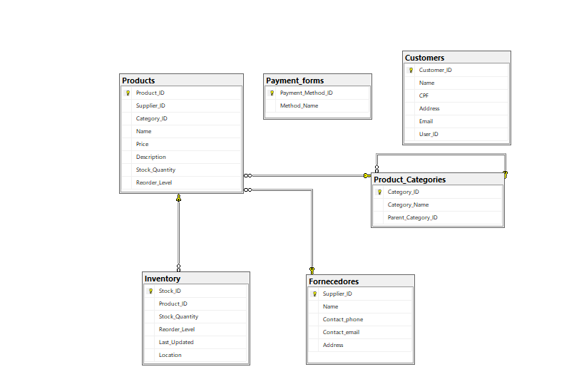

# Games Store Database

## Overview

The **Games Store Database** is a fictional relational database designed to manage operations for an online or physical games store. It handles key aspects of inventory management, product categorization, supplier tracking, customer information, and payment methods. This database is built using Microsoft SQL Server (T-SQL) and serves as an educational or demonstration project to illustrate relational database design principles, including normalization, foreign key relationships, and hierarchical categorization.

The database models a typical e-commerce setup for gaming products, including games, consoles, accessories, and PC components. It supports features like stock tracking, reorder alerts, and customer uniqueness via CPF (Brazilian ID) and email.

### Key Features
- **Relational Structure**: Tables are normalized to reduce redundancy and ensure data integrity.
- **Hierarchical Categories**: Supports parent-child relationships for product categories (e.g., Consoles > Sony > PS5).
- **Inventory Management**: Tracks stock levels with automatic timestamps for updates.
- **Sample Data**: Includes pre-inserted records for suppliers, categories, products, and more to facilitate testing.
- **Constraints**: Enforces uniqueness (e.g., supplier names, customer emails) and referential integrity via foreign keys.

This database can be extended for real-world use, such as integrating with applications for sales tracking, reporting, or e-commerce platforms.

## Database Schema

The database consists of the following tables:

### 1. Suppliers
Stores information about product suppliers.
- **Columns**:
  - `Supplier_ID` (INT, PK, IDENTITY): Unique identifier.
  - `Name` (NVARCHAR(35), NOT NULL, UNIQUE): Supplier name.
  - `Contact_phone` (NVARCHAR(100), NOT NULL, UNIQUE): Contact phone number.
  - `Contact_email` (NVARCHAR(100), NOT NULL, UNIQUE): Contact email.
  - `Address` (NVARCHAR(100), NOT NULL): Supplier address.
- **Relationships**: Referenced by `Products` table.

### 2. Product_Categories
Manages hierarchical product categories (e.g., main categories and subcategories).
- **Columns**:
  - `Category_ID` (INT, PK, IDENTITY): Unique identifier.
  - `Category_Name` (NVARCHAR(50), NOT NULL): Category name.
  - `Parent_Category_ID` (INT, NULL): References parent category for hierarchy.
- **Constraints**:
  - Foreign Key: `FK_ParentCategory` references `Product_Categories(Category_ID)`.
- **Relationships**: Self-referencing for hierarchy; referenced by `Products` and `Product_Subcategories`.

### 3. Products
Core table for storing product details.
- **Columns**:
  - `Product_ID` (INT, PK, IDENTITY): Unique identifier.
  - `Supplier_ID` (INT, NOT NULL): References supplier.
  - `Category_ID` (INT, NOT NULL): References category.
  - `Name` (NVARCHAR(100), NOT NULL): Product name.
  - `Price` (DECIMAL(10, 2), NOT NULL): Product price.
  - `Description` (NVARCHAR(500), NULL): Product description.
  - `Stock_Quantity` (INT, NOT NULL): Current stock level.
  - `Reorder_Level` (INT, NOT NULL): Threshold for reordering.
- **Constraints**:
  - Foreign Key: `FK_Supplier` references `Suppliers(Supplier_ID)`.
  - Foreign Key: `FK_Category` references `Product_Categories(Category_ID)`.
- **Relationships**: Referenced by `Inventory`.

### 4. Product_Subcategories
Handles subcategories linked to main categories (note: this table may overlap with hierarchical categories; use for flat substructures if needed).
- **Columns**:
  - `Subcategory_ID` (INT, PK, IDENTITY): Unique identifier.
  - `Subcategory_Name` (NVARCHAR(50), NOT NULL): Subcategory name.
  - `Category_ID` (INT, NOT NULL): References parent category.
- **Constraints**:
  - Foreign Key: `FK_Category` references `Product_Categories(Category_ID)`.

### 5. Customers
Stores customer information with uniqueness constraints.
- **Columns**:
  - `Customer_ID` (INT, PK, IDENTITY): Unique identifier.
  - `Name` (NVARCHAR(100), NOT NULL): Customer name.
  - `CPF` (NVARCHAR(20), UNIQUE, NOT NULL): Brazilian CPF (ID).
  - `Address` (NVARCHAR(100), NOT NULL): Customer address.
  - `Email` (NVARCHAR(100), UNIQUE, NOT NULL): Customer email.
  - `User_ID` (NVARCHAR(50), NOT NULL, UNIQUE): User ID (e.g., for login).

### 6. Payment_forms
Manages available payment methods.
- **Columns**:
  - `Payment_Method_ID` (INT, PK, IDENTITY): Unique identifier.
  - `Method_Name` (NVARCHAR(50), NOT NULL, UNIQUE): Payment method name (e.g., "Credit Card", "Pix").

### 7. Inventory
Tracks detailed stock information with timestamps.
- **Columns**:
  - `Stock_ID` (INT, PK, IDENTITY): Unique identifier.
  - `Product_ID` (INT, NOT NULL): References product.
  - `Stock_Quantity` (INT, NOT NULL): Quantity in stock.
  - `Reorder_Level` (INT, NOT NULL): Reorder threshold.
  - `Last_Updated` (DATETIME, DEFAULT GETDATE()): Last update timestamp.
  - `Location` (NVARCHAR(100), NULL): Warehouse location.
- **Constraints**:
  - Foreign Key: `FK_Product` references `Products(Product_ID)`.

## Entity-Relationship (ER) Diagram

The following ER diagram illustrates the relationships between tables:



- **Products** is central, linking to **Suppliers**, **Product_Categories**, and **Inventory**.
- **Product_Categories** supports self-referencing for hierarchies.
- **Customers** and **Payment_forms** are standalone but can be extended (e.g., for orders table in future iterations).

## Setup Instructions

To set up the database:

1. **Prerequisites**:
   - Microsoft SQL Server (or Azure SQL Database).
   - SQL Server Management Studio (SSMS) or another SQL client.

2. **Create the Database**:
   Run the following SQL script in your SQL client:

   ```sql
   CREATE DATABASE Games_Store;
   GO

   USE Games_Store;
   GO
   ```

3. **Create Tables**:
   Execute the table creation scripts in order (Suppliers first, as it's referenced by Products):

   ```sql
   -- Suppliers table
   CREATE TABLE Suppliers (
       Supplier_ID INT PRIMARY KEY IDENTITY(1,1),
       Name NVARCHAR(35) NOT NULL UNIQUE,
       Contact_phone NVARCHAR(100) NOT NULL UNIQUE,
       Contact_email NVARCHAR(100) NOT NULL UNIQUE,
       Address NVARCHAR(100) NOT NULL
   );
   GO

   -- Product_Categories table
   CREATE TABLE Product_Categories (
       Category_ID INT PRIMARY KEY IDENTITY (1,1),
       Category_Name NVARCHAR(50) NOT NULL,
       Parent_Category_ID INT NULL,
       CONSTRAINT FK_ParentCategory FOREIGN KEY (Parent_Category_ID)
           REFERENCES Product_Categories(Category_ID)
   );
   GO

   -- Products table
   CREATE TABLE Products (
       Product_ID INT PRIMARY KEY IDENTITY (1,1),
       Supplier_ID INT NOT NULL,
       Category_ID INT NOT NULL,
       Name NVARCHAR(100) NOT NULL,
       Price DECIMAL(10, 2) NOT NULL,
       Description NVARCHAR(500) NULL,
       Stock_Quantity INT NOT NULL,
       Reorder_Level INT NOT NULL,
       CONSTRAINT FK_Supplier FOREIGN KEY (Supplier_ID)
           REFERENCES Suppliers(Supplier_ID),
       CONSTRAINT FK_Category FOREIGN KEY (Category_ID)
           REFERENCES Product_Categories(Category_ID)
   );
   GO

   -- Product_Subcategories table
   CREATE TABLE Product_Subcategories (
       Subcategory_ID INT PRIMARY KEY IDENTITY (1,1),
       Subcategory_Name NVARCHAR(50) NOT NULL,
       Category_ID INT NOT NULL,
       CONSTRAINT FK_Category FOREIGN KEY (Category_ID)
           REFERENCES Product_Categories(Category_ID)
   );
   GO

   -- Customers table
   CREATE TABLE Customers (
      Customer_ID INT PRIMARY KEY IDENTITY (1,1),
      Name NVARCHAR(100) NOT NULL,
      CPF NVARCHAR(20) UNIQUE NOT NULL,
      Address NVARCHAR(100) NOT NULL,
      Email NVARCHAR(100) UNIQUE NOT NULL,
      User_ID NVARCHAR(50) NOT NULL UNIQUE
   );

   -- Payment_forms table
   CREATE TABLE Payment_forms (
       Payment_Method_ID INT PRIMARY KEY IDENTITY(1,1),
       Method_Name NVARCHAR(50) NOT NULL UNIQUE
   );
   GO

   -- Inventory table
   CREATE TABLE Inventory (
       Stock_ID INT PRIMARY KEY IDENTITY(1,1),
       Product_ID INT NOT NULL,
       Stock_Quantity INT NOT NULL,
       Reorder_Level INT NOT NULL,
       Last_Updated DATETIME DEFAULT GETDATE(),
       Location NVARCHAR(100) NULL,
       CONSTRAINT FK_Product FOREIGN KEY (Product_ID)
           REFERENCES Products(Product_ID)
   );
   GO
   ```

4. **Insert Sample Data**:
   Run the insertion scripts to populate the tables with example data:

   ```sql
   -- Suppliers
   INSERT INTO Suppliers (Name, Contact_phone, Contact_email, Address) VALUES
   ('Sony', '1111-1111', 'contact@sony.com', 'Tokyo, Japan'),
   ('Microsoft', '2222-2222', 'contact@microsoft.com', 'Redmond, USA'),
   ('Nintendo', '3333-3333', 'contact@nintendo.com', 'Kyoto, Japan'),
   ('Razer', '4444-4444', 'contact@razer.com', 'Singapore'),
   ('Corsair', '5555-5555', 'contact@corsair.com', 'Fremont, USA');

   -- Main Categories
   INSERT INTO Product_Categories (Category_Name, Parent_Category_ID) VALUES
   ('Games', NULL),
   ('Accessories/Peripherals', NULL),
   ('Consoles', NULL),
   ('PCs/Components', NULL);

   -- Subcategories (examples for Accessories, Consoles, etc.)
   -- ... (Full insertion scripts as provided in the source code)
   -- Products (examples)
   -- ... (Full insertion scripts as provided)
   ```

5. **Verification**:
   Query the tables to confirm setup, e.g.:
   ```sql
   SELECT * FROM Products;
   ```

## Potential Extensions
- Add an **Orders** table to link customers, products, and payments.
- Implement triggers for automatic stock updates on sales.
- Integrate with Python (e.g., via pyodbc) for data analysis, as hinted in related Pandas materials.
- Add views or stored procedures for common queries like low-stock alerts.

## License
This project is for educational purposes and is released under the MIT License. Feel free to use, modify, or distribute.

For questions or contributions, contact @patrickpassosb.
